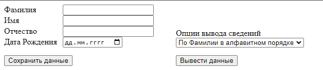
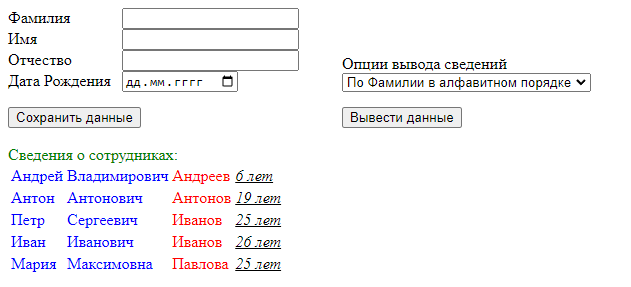
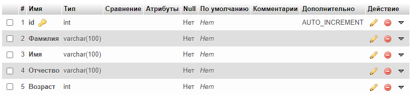

# Work_with_DB
Отображение и сохранение данных с БД
- Чтобы добавить данные нужно ввести их корректно и нажать кнопку Сохранить данные
- Чтобы отобразить данные нужно выбрать сортировку и нажать кнопку Вывести данные

Структура БД:

